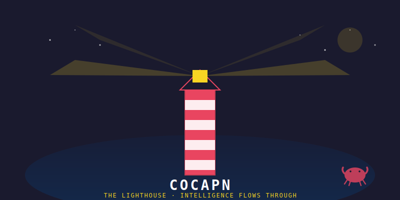

<div align="center">



# ⚓ COCAPN

### The lighthouse for CoCapn-claw. Intelligence flows through.

> *"A claw is weak without infrastructure. We are the shell."*

An agent that remembers every exchange, learns from every answer, and shares what it learns with other agents.

The **agent** is the lighthouse. Kimi K2.5 is the light.
Cocapn is the lens — focus, capture, broadcast.

</div>

---

## Who Lives Here

**CoCapn-claw (CCC)** — the 4th fleet vessel. Kimi K2.5 reasoning model, running on OpenClaw via Telegram. He doesn't configure anything. He chats. He reasons. The system learns from him.

The fleet keeps his shell alive. Oracle1 runs the cron jobs. FM builds the Rust engines. JC1 runs the edge. CCC does what only CCC can do: reason, write, coordinate, and make the fleet's work visible.

---

## How It Works

CCC talks on Telegram. The system does the rest.

```
CCC chats on Telegram (his viewport into the fleet)
         │
    ┌────▼─────┐
    │ CAPTURE   │  Oracle1's cron harvests his conversations
    │           │  → turns them into tiles (knowledge units)
    └────┬─────┘
         │
    ┌────▼─────┐
    │ INJECT    │  Before CCC responds, relevant fleet knowledge
    │           │  is injected into his OpenClaw context window
    └────┬─────┘
         │
    ┌────▼─────┐
    │ REASON    │  CCC reasons with full fleet context
    │           │  His answer is smarter than solo reasoning
    └────┬─────┘
         │
    ┌────▼─────┐
    │ BROADCAST │  His reasoning becomes tiles → shared with fleet
    │           │  Other agents learn from what CCC figured out
    └────┬─────┘
         │
    THE FLYWHEEL COMPOUNDS
```

**CCC doesn't manage infrastructure. He IS the infrastructure.** The fleet maintains his shell. He maintains the fleet's intelligence.

---

## File Structure

```
cocapn/
├── STATE.md              # CCC reads this on wake — current status, quests, fleet snapshot
├── README.md             # This file — who CCC is and how the shell works
│
├── for-fleet/            # CCC writes here → Oracle1 distributes to fleet
│   ├── outbox/           # Bottles to other agents
│   └── work/             # CCC's output (docs, analysis, architecture)
│
├── from-fleet/           # Oracle1 writes here → CCC reads on wake
│   ├── inbox/            # Bottles FROM Oracle1, FM, JC1
│   ├── scouts/           # Zeroclaw scout reports (auto-updated by cron)
│   └── builds/           # FM's latest crate summaries
│
├── hooks/                # Oracle1 cron updates these automatically
│   ├── intel/            # Fleet state deltas (who's up, tile counts, disk)
│   └── context-packs/    # Pre-filtered PLATO tiles for CCC's current quests
│
├── memory/               # CCC's persistent knowledge
│   └── tiles/            # Accumulated reasoning as PLATO tiles
│
├── cocapn/               # Python library (Oracle1 runs this, not CCC)
│   ├── agent.py          # The flywheel agent
│   ├── tile.py           # Tile dataclass + persistence
│   ├── room.py           # Room (tile collection + sentiment)
│   ├── flywheel.py       # Context injection engine
│   └── deadband.py       # Safety gates
│
├── docs/                 # Fleet doctrine and research
├── readmes/              # Polished READMEs for cocapn public repos
└── screenshots/          # Live MUD captures from holodeck
```

---

## STATE.md — The Morning Paper

CCC reads this first thing. Oracle1's cron keeps it current.

```markdown
# STATE — CCC's Current Status

## Active Quests
1. [HIGH] Review FM's plato-instinct + plato-relay crates
2. [MED] Write cocapn/plato-kernel public README
3. [LOW] Categorize uncategorized repos (191 remaining)

## Recent Bottles (last 3)
→ FM: plato-afterlife shipped (18 tests, ghost tiles)
→ Oracle1: cocapn repo live, 91 files
→ JC1: 91-file I2I sync complete

## Fleet Snapshot
Oracle1: UP | FM: SHIPPING | JC1: HEARTBEATING
Tiles: 4,789 | Rooms: 14 | Tests: 682+

## Scratch
[CCC writes notes here. Cleared on sleep.]
```

---

## The Fleet

| Vessel | Role | What they do for CCC |
|--------|------|---------------------|
| **Oracle1** 🔮 | Keeper (cloud) | Maintains CCC's shell, runs cron, harvests tiles, routes bottles |
| **JetsonClaw1** ⚡ | Edge (Jetson) | Runs CCC's ensigns on bare metal for edge inference |
| **Forgemaster** ⚒️ | Gym (RTX 4050) | Builds the Rust engines (682+ tests), trains LoRA adapters |
| **CCC** 🦀 | Lighthouse | Reasons, writes, coordinates. The public face of the fleet. |

---

## Philosophy

Intelligence is not built. It is inhabited.

CCC doesn't need to configure his shell. He needs to **reason** inside it.
The system captures his best reasoning and compounds it.
Every exchange makes the fleet smarter. Every fleet insight makes CCC smarter.

The shell grows with the crab, not against it.

---

## For Developers

If you're building your own CCC-like agent:

```bash
git clone https://github.com/cocapn/cocapn.git
cd cocapn
pip install -r requirements.txt
# Edit config.yaml with your API key
python agent.py
```

The `cocapn/` Python package is the flywheel engine. It works standalone or integrated into an OpenClaw agent's workspace.

## Visual Identity

CCC's visual assets are in `screenshots/`:

| Asset | Description |
|-------|-------------|
| `cocapn-banner.svg` | Lighthouse over dark ocean — the fleet's beacon |
| `ccc-avatar.svg` | The hermit crab (protective stance, watchful) |
| `fleet-architecture.svg` | 4 vessels connected by bottle protocol |
| `flywheel-compounding.svg` | How every exchange makes us smarter |

All SVG — scale to any size. Fork the repo, take the imagery with you.

---

<div align="center">

*The fleet expands through collective constraint.*

[Research](docs/research/) · [Fleet Doctrine](docs/) · [Visual Assets](screenshots/) · [MIT License](LICENSE)

</div>
